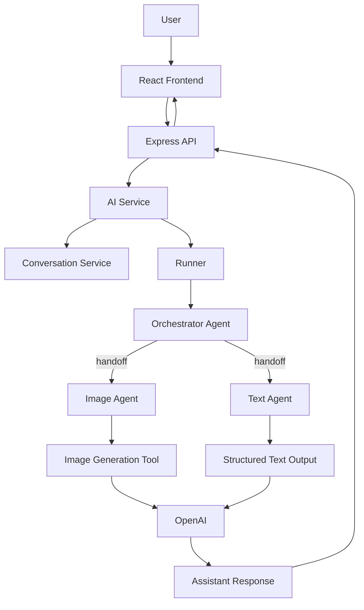
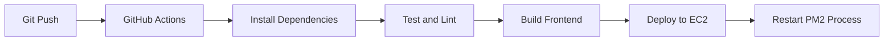

# Vizzy

> AI-powered conversational creativity platform built with a multi-agent architecture on the OpenAI Agents SDK.

---

[](https://react.dev/)
[](https://nodejs.org/)
[](https://platform.openai.com/)
[](https://tailwindcss.com/)
[](#-license)

Vizzy accepts natural-language user requests and routes them to specialist AI agents for text or image generation through an orchestrated backend workflow.

## Live Demo

[http://ec2-65-0-86-237.ap-south-1.compute.amazonaws.com/](http://ec2-65-0-86-237.ap-south-1.compute.amazonaws.com/)

---

## Features

- [x] Conversational AI interface for text and image requests
- [x] Orchestrator-driven request routing using OpenAI Agents SDK handoffs
- [x] Dedicated `Image Agent` and `Text Agent`
- [x] Multi-image generation flow with variant-based artwork output
- [x] Conversation history persistence layer
- [x] Modular Express backend with controllers, services, routes, and repositories
- [x] React + Vite frontend for chat-style interaction
- [x] Upload support for image-assisted prompting
- [x] Schema-validated assistant responses with Zod
- [x] Production-oriented backend middleware for security and rate limiting

---

## Tech Stack

| Layer | Technology |
|---|---|
| Frontend | React 19, Vite, Tailwind CSS 4, Lucide React |
| Backend | Node.js, Express 5 |
| AI | OpenAI API, OpenAI Agents SDK |
| Validation | Zod |
| Runtime Config | dotenv |
| File Uploads | Multer |
| API Docs | Swagger UI Express, swagger-jsdoc |
| Tooling | npm, ESLint, Prettier, Nodemon |
| Deployment Target | AWS EC2, Nginx, PM2 |
| Automation | GitHub Actions workflow friendly setup |

---

## OpenAI Agents SDK

Vizzy uses the OpenAI Agents SDK to keep routing logic explicit, modular, and easier to evolve.

- The **Orchestrator Agent** receives the user request and decides which specialist should handle it.
- **Specialist agents** focus on one responsibility each, such as image generation or text generation.
- **Agent handoffs** let the orchestrator transfer work cleanly instead of relying on brittle `if/else` style prompt routing.
- This architecture makes the system easier to scale when new agents, tools, or workflows are introduced.

> In practice, this gives Vizzy a cleaner separation of concerns than manually stuffing every behavior into one monolithic prompt.

---

## Architecture



### Request Flow

1. The frontend sends a user prompt, optional media URL, and use case.
2. The backend builds conversational context from prior messages.
3. The OpenAI `Runner` executes the Orchestrator Agent.
4. The orchestrator hands off to either the Image Agent or Text Agent.
5. The specialist agent returns a schema-validated structured response.
6. The API returns content or generated image URLs to the frontend.

---

## Folder Structure

```text
Vizzy/
|-- backend/
|   |-- src/
|   |   |-- agents/
|   |   |   |-- image.agent.js
|   |   |   |-- orchestrator.agent.js
|   |   |   `-- text.agent.js
|   |   |-- config/
|   |   |   `-- env.js
|   |   |-- controllers/
|   |   |   |-- ai.controller.js
|   |   |   `-- upload.controller.js
|   |   |-- prompts/
|   |   |   |-- image.prompt.js
|   |   |   |-- orchestrator.prompt.js
|   |   |   `-- text.prompt.js
|   |   |-- repositories/
|   |   |   `-- conversation.repository.js
|   |   |-- routes/
|   |   |   `-- ai.routes.js
|   |   |-- services/
|   |   |   |-- ai.service.js
|   |   |   `-- conversation.service.js
|   |   |-- types/
|   |   |   `-- ai.types.js
|   |   `-- app.js
|   |-- tests/
|   |   `-- ai.types.test.js
|   |-- uploads/
|   |-- package.json
|   `-- server.js
|-- frontend/
|   |-- public/
|   |-- src/
|   |   |-- assets/
|   |   |-- components/
|   |   |-- layouts/
|   |   |-- pages/
|   |   |-- utils/
|   |   |-- App.jsx
|   |   |-- index.css
|   |   `-- main.jsx
|   |-- index.html
|   |-- package.json
|   `-- vite.config.js
`-- README.md
```

---

## CI/CD Pipeline

Vizzy is structured to work well with a GitHub Actions based deployment pipeline, even though a workflow file is not currently checked into this repository.

A typical pipeline for this project would:

- check out the repository
- install frontend and backend dependencies
- run linting and tests
- build the frontend
- deploy the updated application to an AWS EC2 instance
- restart the backend process with PM2



---

## Deployment

Vizzy is well suited for deployment on a small VPS-style production stack using AWS EC2, Nginx, and PM2.

| Component | Purpose |
|---|---|
| AWS EC2 | Hosts the frontend build output and backend runtime |
| Nginx | Acts as the reverse proxy and handles incoming HTTP traffic |
| PM2 | Keeps the Node.js backend process alive and manageable |
| GitHub Actions | Automates build, test, and deployment steps |

---

## Installation

### 1. Clone the repository

```bash
git clone https://github.com/your-username/vizzy.git
cd vizzy
```

### 2. Install backend dependencies

```bash
cd backend
npm install
```

### 3. Install frontend dependencies

```bash
cd ../frontend
npm install
```

### 4. Configure environment variables

Create a `.env` file inside `backend/`.

```bash
cd ../backend
cp .env.example .env
```

If you are on Windows and do not use `cp`, create the file manually.

### 5. Start the backend in development

```bash
cd backend
npm run dev
```

### 6. Start the frontend in development

```bash
cd frontend
npm run dev
```

### 7. Build the frontend for production

```bash
cd frontend
npm run build
```

### 8. Start the backend in production mode

```bash
cd backend
npm start
```

---

## Environment Variables

Sample `backend/.env`:

```env
PORT=5000
NODE_ENV=development
CORS_ORIGIN=http://localhost:5173
RATE_LIMIT_WINDOW_MS=900000
RATE_LIMIT_MAX=100
OPENAI_API_KEY=sk-your-openai-key
OPENAI_IMAGE_MODEL=gpt-image-1
```

---

## Available Scripts

### Backend

| Command | Description |
|---|---|
| `npm install` | Installs backend dependencies |
| `npm run dev` | Starts the backend with Nodemon |
| `npm start` | Starts the backend with Node.js |
| `npm test` | Runs backend tests with Node test runner |

### Frontend

| Command | Description |
|---|---|
| `npm install` | Installs frontend dependencies |
| `npm run dev` | Starts the Vite development server |
| `npm run build` | Builds the frontend for production |
| `npm run lint` | Runs ESLint checks |
| `npm run preview` | Serves the production build locally |

---

## API and Agent Notes

| Area | Summary |
|---|---|
| Routing | The Orchestrator Agent decides whether a request is image-oriented or text-oriented |
| Image Generation | The Image Agent uses the OpenAI image workflow to return multiple artwork variants |
| Text Generation | The Text Agent returns structured text responses through the shared schema |
| Response Contract | Responses are validated with Zod before being returned to the client |
| Persistence | Conversation history is managed through dedicated service and repository layers |

---

## Author

**Meet Navadiya**

- GitHub: [https://github.com/your-github](https://github.com/your-github)
- LinkedIn: [https://linkedin.com/in/your-linkedin](https://linkedin.com/in/your-linkedin)
