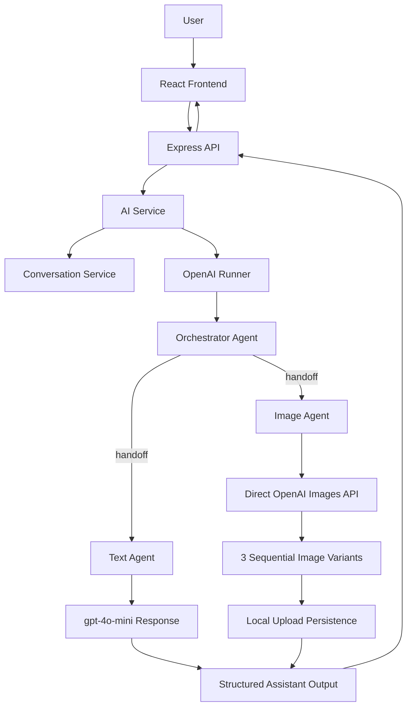

# Vizzy

> AI-powered conversational creativity platform built with a multi-agent architecture on the OpenAI Agents SDK.

---

[](https://react.dev/)
[](https://nodejs.org/)
[](https://platform.openai.com/)
[](https://tailwindcss.com/)
[](#-license)

Vizzy accepts natural-language user requests and routes them to specialist AI agents for text or image generation through an orchestrated backend workflow.

---

## LIVE Demo Link

[http://ec2-65-2-186-103.ap-south-1.compute.amazonaws.com/](http://ec2-65-2-186-103.ap-south-1.compute.amazonaws.com/)

---

## Features

- [x] Conversational AI interface for text and image requests
- [x] Orchestrator-driven request routing using OpenAI Agents SDK handoffs
- [x] Dedicated `Image Agent` and `Text Agent`
- [x] Multi-image generation flow with variant-based artwork output
- [x] Conversation history persistence layer
- [x] Modular Express backend with controllers, services, routes, and repositories
- [x] React + Vite frontend for chat-style interaction
- [x] Upload support for image-assisted prompting
- [x] Schema-validated assistant responses with Zod
- [x] Production-oriented backend middleware for security and rate limiting

---

## Tech Stack

| Layer | Technology |
|---|---|
| Frontend | React 19, Vite, Tailwind CSS 4, Lucide React |
| Backend | Node.js, Express 5 |
| AI | OpenAI API, OpenAI Agents SDK |
| Text Model | `gpt-4o-mini` |
| Image Model | `gpt-image-1` via `OPENAI_IMAGE_MODEL` |
| Validation | Zod |
| Runtime Config | dotenv |
| File Uploads | Multer |
| API Docs | Swagger UI Express, swagger-jsdoc |
| Tooling | npm, ESLint, Prettier, Nodemon |

---

## OpenAI Agents SDK

Vizzy uses the OpenAI Agents SDK to keep routing logic explicit, modular, and easier to evolve.

- The **Orchestrator Agent** receives the user request and decides which specialist should handle it.
- **Specialist agents** focus on one responsibility each, such as image generation or text generation.
- **Agent handoffs** let the orchestrator transfer work cleanly instead of relying on brittle `if/else` style prompt routing.
- This architecture makes the system easier to scale when new agents, tools, or workflows are introduced.

> In practice, this gives Vizzy a cleaner separation of concerns than manually stuffing every behavior into one monolithic prompt.

### Model Configuration

| Capability | Current Model | Where It Is Used |
|---|---|---|
| Text generation | `gpt-4o-mini` | `backend/src/agents/text.agent.js` |
| Image generation | `gpt-image-1` by default, configurable through `OPENAI_IMAGE_MODEL` | `backend/src/agents/image.agent.js` |

---

## Architecture



### Request Flow

1. The frontend sends a user prompt, optional media URL, and use case.
2. The backend builds conversational context from prior messages.
3. The OpenAI `Runner` executes the Orchestrator Agent.
4. The orchestrator hands off to either the Image Agent or Text Agent.
5. The Text Agent generates structured text with `gpt-4o-mini`.
6. The Image Agent calls the OpenAI Images API three times in sequence with variant prompts, stores the generated files locally, and returns public image URLs.
7. The API returns content or generated image URLs to the frontend.

---

## Deployment

Vizzy is deployed using a GitHub Actions CI/CD pipeline and runs inside Docker on a single AWS EC2 instance.

- **CI/CD Pipeline:** GitHub Actions automates the deployment workflow so code changes can move from repository updates to the live server in a consistent way.
- **Containerized Runtime:** The application is packaged as one Docker container that builds the React + Vite frontend and runs the Express backend.
- **AWS EC2 Hosting:** The Docker container runs on an AWS EC2 instance, where Express serves both the production frontend build and the `/api` routes from the same application.

---

## Folder Structure

```text
Vizzy/
|-- backend/
|   |-- src/
|   |   |-- agents/
|   |   |   |-- image.agent.js
|   |   |   |-- orchestrator.agent.js
|   |   |   `-- text.agent.js
|   |   |-- config/
|   |   |   `-- env.js
|   |   |-- controllers/
|   |   |   |-- ai.controller.js
|   |   |   `-- upload.controller.js
|   |   |-- prompts/
|   |   |   |-- image.prompt.js
|   |   |   |-- orchestrator.prompt.js
|   |   |   `-- text.prompt.js
|   |   |-- repositories/
|   |   |   `-- conversation.repository.js
|   |   |-- routes/
|   |   |   `-- ai.routes.js
|   |   |-- services/
|   |   |   |-- ai.service.js
|   |   |   `-- conversation.service.js
|   |   |-- types/
|   |   |   `-- ai.types.js
|   |   `-- app.js
|   |-- tests/
|   |   `-- ai.types.test.js
|   |-- uploads/
|   |-- package.json
|   `-- server.js
|-- frontend/
|   |-- public/
|   |-- src/
|   |   |-- assets/
|   |   |-- components/
|   |   |-- layouts/
|   |   |-- pages/
|   |   |-- utils/
|   |   |-- App.jsx
|   |   |-- index.css
|   |   `-- main.jsx
|   |-- index.html
|   |-- package.json
|   `-- vite.config.js
`-- README.md
```

---

## Installation

### 1. Clone the repository

```bash
git clone https://github.com/your-username/vizzy.git
cd vizzy
```

### 2. Install backend dependencies

```bash
cd backend
npm install
```

### 3. Install frontend dependencies

```bash
cd ../frontend
npm install
```

### 4. Configure environment variables

Create a `.env` file inside `backend/`.

```bash
cd ../backend
cp .env.example .env
```

If you are on Windows and do not use `cp`, create the file manually.

### 5. Start the backend in development

```bash
cd backend
npm run dev
```

### 6. Start the frontend in development

```bash
cd frontend
npm run dev
```

### 7. Build the frontend for production

```bash
cd frontend
npm run build
```

### 8. Start the backend in production mode

```bash
cd backend
npm start
```

---

## Environment Variables

Sample `backend/.env`:

```env
PORT=5000
NODE_ENV=development
CORS_ORIGIN=http://localhost:5173
RATE_LIMIT_WINDOW_MS=900000
RATE_LIMIT_MAX=100
OPENAI_API_KEY=sk-your-openai-key
OPENAI_IMAGE_MODEL=gpt-image-1
```

---

## Available Scripts

### Backend

| Command | Description |
|---|---|
| `npm install` | Installs backend dependencies |
| `npm run dev` | Starts the backend with Nodemon |
| `npm start` | Starts the backend with Node.js |
| `npm test` | Runs backend tests with Node test runner |

### Frontend

| Command | Description |
|---|---|
| `npm install` | Installs frontend dependencies |
| `npm run dev` | Starts the Vite development server |
| `npm run build` | Builds the frontend for production |
| `npm run lint` | Runs ESLint checks |
| `npm run preview` | Serves the production build locally |

---

## API and Agent Notes

| Area | Summary |
|---|---|
| Routing | The Orchestrator Agent decides whether a request is image-oriented or text-oriented |
| Image Generation | The Image Agent uses the direct OpenAI Images API in 3 sequential iterations to return multiple artwork variants |
| Text Generation | The Text Agent uses `gpt-4o-mini` and returns structured text responses through the shared schema |
| Response Contract | Responses are validated with Zod before being returned to the client |
| Persistence | Conversation history is managed through dedicated service and repository layers |

---

## Author

**Meet Navadiya**

- GitHub: [https://github.com/your-github](https://github.com/your-github)
- LinkedIn: [https://linkedin.com/in/your-linkedin](https://linkedin.com/in/your-linkedin)
